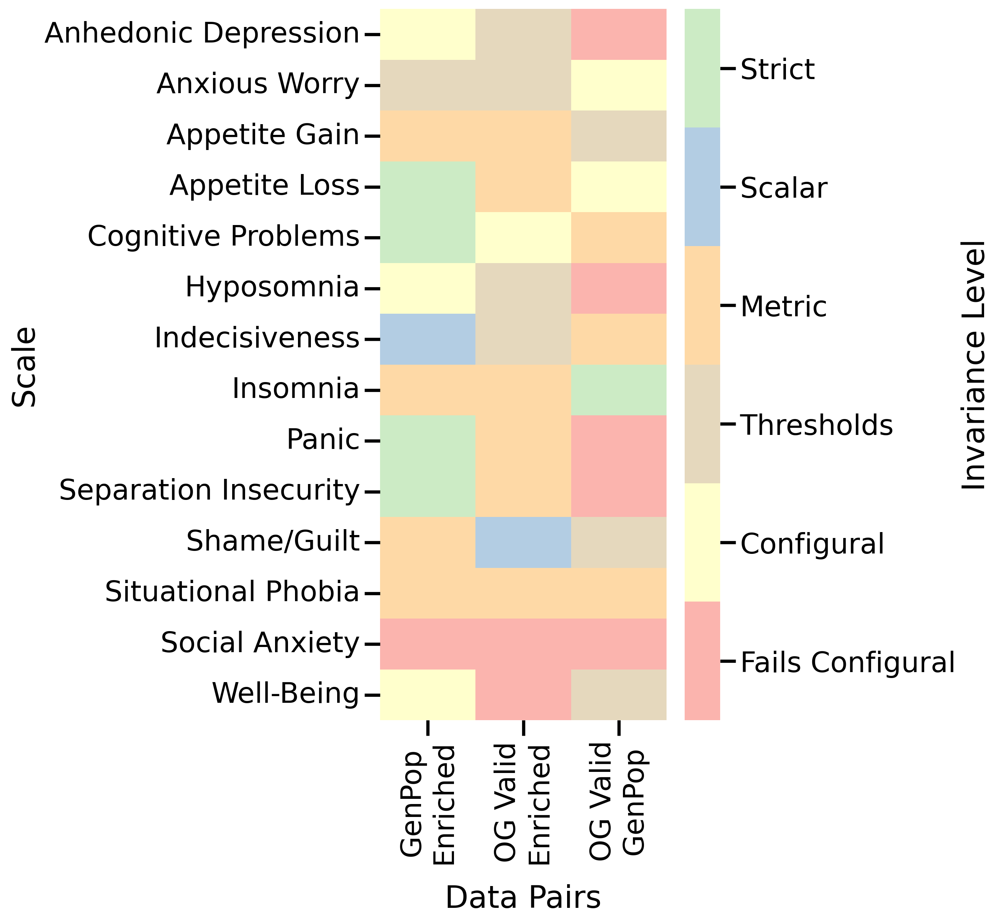
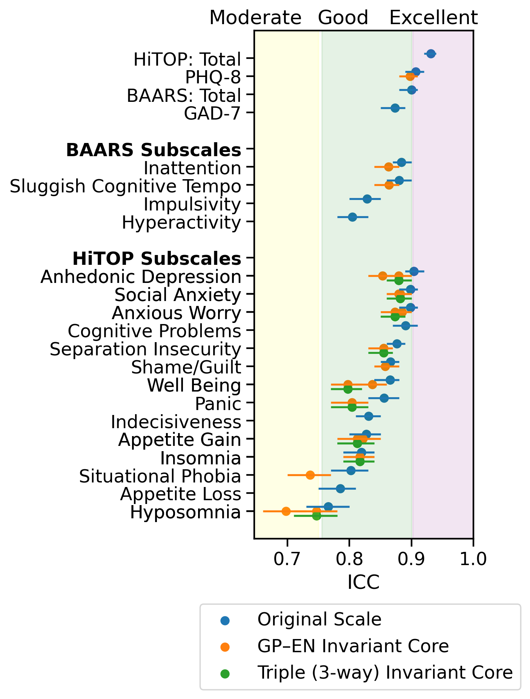
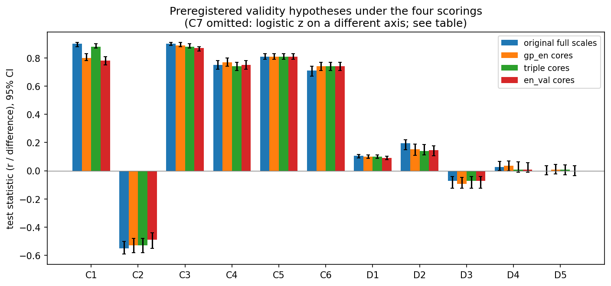
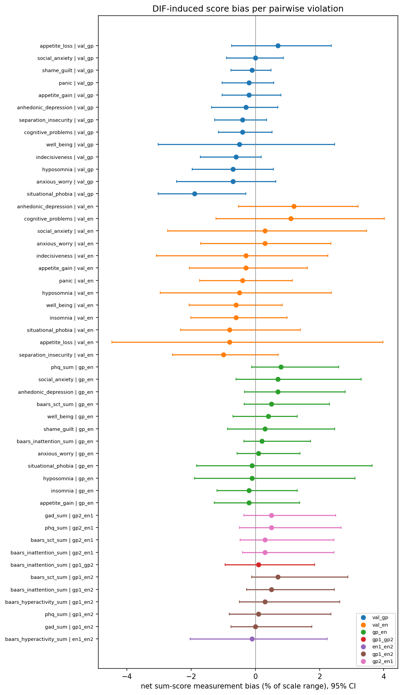
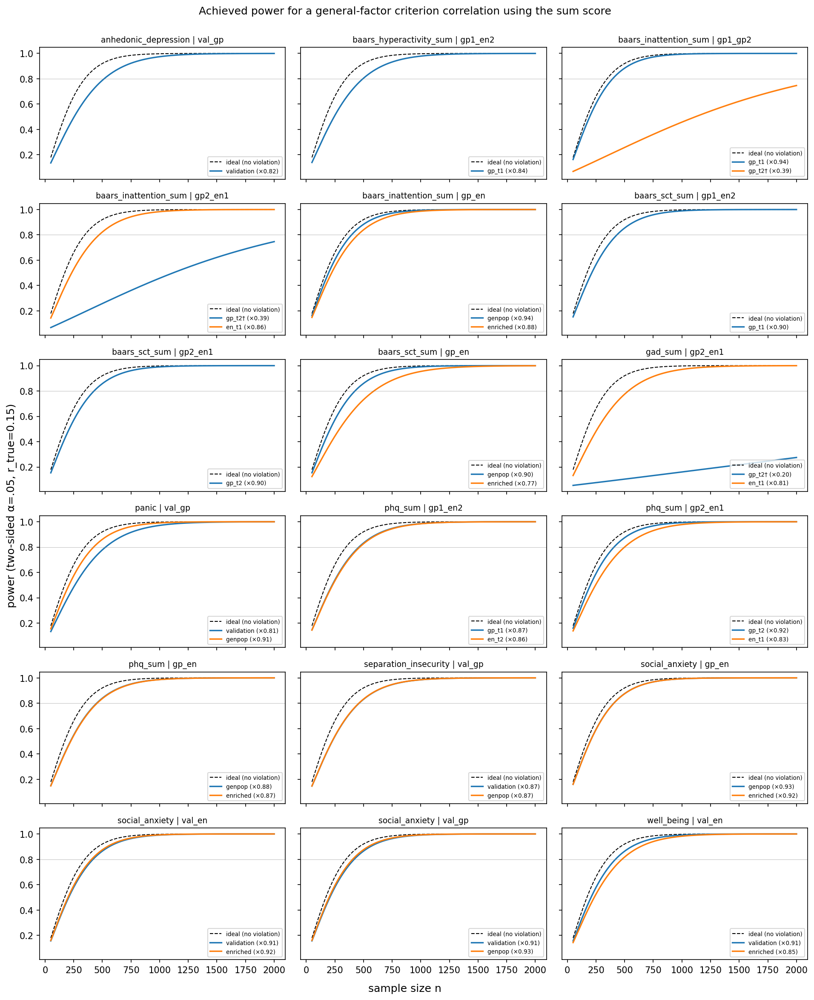
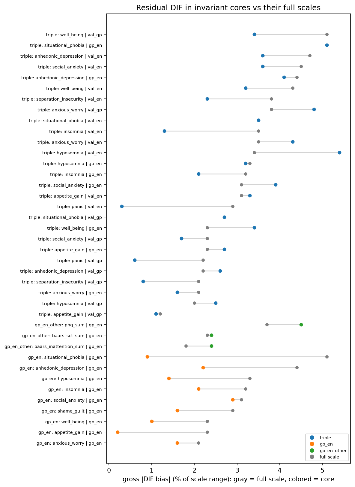

# Results: Test–retest reliability and measurement invariance of HiTOP internalizing scales (2-week window)

All analyses use the corrected Wu–Estabrook measurement-invariance pipeline
(`src/hitop_cfa/`; see `HANDOFF_measeq_fix.md` for the correction record).
Every number below names the notebook that generated it, and every figure
caption names the notebook that drew it. Confirmatory vs exploratory status
follows the preregistration (`prereg.txt`); deviations from the
preregistered methods are listed explicitly in
[Methods deviations](#methods-deviations-from-the-preregistration).

## Top-level findings

1. **Cross-sample invariance broadly fails; within-sample cross-wave
   invariance broadly holds.** Under permutation-tested Wu–Estabrook
   ladders (1000 permutations, WLSMV), every one of the 14 HiTOP subscales
   fails full invariance somewhere across the three sample pairs (validation–GP,
   validation–EN, GP–EN); only impulsivity among the PHQ/GAD/BAARS scales
   survives every comparison. Meanwhile GP wave 1 vs wave 2 and EN wave 1
   vs wave 2 pass through strict invariance for nearly everything
   (`NB_2_cfa_as_reg.ipynb`, `NB_2_cfa_as_reg_other_*.ipynb`).
2. **Conventional ΔCFI/ΔRMSEA criteria miss all of it.** Every scale that
   fails the permutation tests — including the PHQ-8 across GP–EN — passes
   the conventional |ΔCFI| ≤ .01 / ΔRMSEA ≤ .015 screen at every level
   (`NB_phq8_gp_en_followup.ipynb`).
3. **Stepwise item removal restores invariance.** Between GP and EN, all
   14 HiTOP subscales reach a scalar-invariant core (5 already at full
   scale). Across all three samples simultaneously, 10 of 14 get a core
   (3 scalar-level, 7 metric-level fallback)
   (`NB_2_cfa_as_reg_gp_en.ipynb`, `NB_2_cfa_as_reg.ipynb`).
4. **The violations are real at item level but mostly cancel in sum
   scores.** 109 of 328 item DIF estimates have 95% CIs excluding zero,
   yet only 1 of 49 scale×pair net-bias CIs does (situational phobia,
   validation–GP: −0.29 points ≈ 1.9% of range), and gross bias never
   exceeds ~5% of scale range (`NB_invariance_effect_sizes.ipynb`).
5. **Dimensionality violations cost modest power, with one exception.**
   Most groups sit at ωH ≈ .70–.86 (criterion-correlation attenuation
   ×.84–.93; 1.2–1.5× required-n inflation). SCT in the enriched sample is
   the interpretable worst case: ωH = .59, 1.70× required-n inflation, and
   the sum conflates two factors (`NB_invariance_effect_sizes.ipynb`).
6. **Validity conclusions are robust to core scoring.** All seven
   preregistered convergent hypotheses (C1–C7) are supported under the
   original full scales, the triple cores, and the GP–EN cores alike;
   D1 and D2 are supported, D3–D5 are not, under all three scorings.
   15 of 16 hypothesis outcomes agree across the three scorings
   (`NB_core_effects.ipynb`).
7. **Test–retest reliability is good-to-excellent and survives item
   removal.** Combined-sample ICC(2,1): instrument totals .87–.93; HiTOP
   subscales .77–.90. Under both core sets (the preregistered GP–EN cores
   and the stricter triply invariant cores), invariant cores lose at most
   .07 ICC relative to their full scales (median loss ≈ .02)
   (`NB_3_ICC.ipynb`).

## Confirmatory vs exploratory

Per `prereg.txt`, the confirmatory analyses are:

| Analysis | Status | Where |
|---|---|---|
| Invariance ladder, validation vs GP wave 1 | **Confirmatory** | `NB_2_cfa_as_reg.ipynb` (V_GP rows) |
| Invariance ladder, GP wave 1 vs EN wave 1 | **Confirmatory** | `NB_2_cfa_as_reg.ipynb` (GP_EN rows), `NB_2_cfa_as_reg_gp_en.ipynb` |
| Invariance of PHQ-8 / GAD-7 / BAARS-IV subscales (GP–EN) | **Confirmatory** | `NB_2_cfa_as_reg_other_gp_en.ipynb` |
| Stepwise removal to a scalar-invariant core | **Confirmatory** (procedure modified; see deviations) | stepwise sections of the pipeline notebooks |
| ICC(2,1) per scale, GP / EN / combined, full scales and cores | **Confirmatory** (quantification only — no hypotheses) | `NB_3_ICC.ipynb`, `NB_icc_plots.ipynb` |
| C1–C7 convergent and D1–D5 divergent hypotheses with GP–EN cores | **Confirmatory** | `NB_core_effects.ipynb` (gp_en core set) |

Everything else is **exploratory**: the validation–EN pair; the 5-level
thresholds tier itself (see deviations); the wave and crossed-wave
comparisons (`NB_2_cfa_as_reg_other_{gp1_gp2,en1_en2,gp1_en2,gp2_en1}.ipynb`);
the exhaustive invariant-subset searches (`NB_2_cfa_exploratory.ipynb`,
`notebooks/run_exhaustive_scale.py`); all DIF/dimensionality/power effect
sizes and EFAs (`NB_invariance_effect_sizes.ipynb`); the PHQ-8 follow-up
(`NB_phq8_gp_en_followup.ipynb`); and the triple-core variant of the
validity hypotheses (`NB_core_effects.ipynb`, triple core set — a
sensitivity analysis; the prereg specifies GP–EN cores).

## Methods deviations from the preregistration

1. **Model identification.** The prereg specified the first item of each
   subscale as the marker item. The pipeline instead uses Wu & Estabrook
   (2016) identification for ordinal indicators
   (`semTools::measEq.syntax`, `ID.cat = "Wu.Estabrook.2016"`,
   `ID.fac = "std.lv"`, theta parameterization), which is the
   psychometrically correct identification for ordered-categorical
   invariance testing. Reason and record: `HANDOFF_measeq_fix.md`.
2. **Five-level ladder.** The prereg named four levels (configural,
   metric, scalar, strict). With ordinal indicators, threshold invariance
   is a distinct, prior level; the pipeline tests
   configural → thresholds → metric → scalar → strict.
3. **Permutation machinery at scalar/strict.** Wu–Estabrook encodes
   scalar/strict constraints by *fixing* parameters rather than equality
   constraints, so `permuteMeasEq`'s parameter-targeted tests are
   undefined there; the pipeline uses the parameter-free omnibus
   permutation test at those levels, and `lavaan::modindices()` score
   tests (rather than "permuted maximum modification index") to choose
   stepwise removals at the scalar tier. Removals at the thresholds tier
   use permuted MIs as preregistered.
4. **Scales without an invariant core in the validity tests.** The prereg
   says such scales' hypotheses should be tested in the enriched sample
   only; the analysis code instead falls back to the full scale with a
   printed warning (affects the triple core set only:
   appetite_loss, cognitive_problems, indecisiveness, shame_guilt — see
   the resolution table printed in `NB_core_effects.ipynb`). Under the
   confirmatory GP–EN core set every scale has a core, so no fallback is
   triggered there.
5. **Secondary fit criteria.** The prereg's "RMSEA < 0.6" is treated as
   the evident typo for .06; the pipeline reads robust CFI/TLI ≥ .95 and
   robust RMSEA ≤ .06 via `fitMeasures`.

## Samples

From `NB_1_preprocess_and_descriptive.ipynb`: validation sample n = 496
(Watson et al., 2022; mean age 31.7). YouGov general-population sample:
500 recruited → 497 retained for the CFA analyses (grid attention check at
first visit) and 398 for ICC (grid checks at both visits); mean age 51.1.
Enriched sample (screened for diagnosed, currently bothersome
depression/anxiety/ADHD): 310 → 305 (CFA) and 255 (ICC); mean age 41.0.
Mean retest gap ≈ 9.5 days (GP) and 8.5 days (EN).

## Full-scale invariance across samples (3-way)

Baselines in `data/cfa/orig_cfa_res.csv`, generated in
`NB_2_cfa_as_reg.ipynb` (1000-permutation Wu–Estabrook ladders; a level
"fails" at permutation p < .05; configural failures may continue via the
secondary fit criteria). First failing level per scale × pair:

| scale | V_GP (confirmatory) | GP_EN (confirmatory) | V_EN (exploratory) |
|---|---|---|---|
| anhedonic_depression | configural | thresholds | metric |
| anxious_worry | thresholds | metric | metric |
| appetite_gain | metric | scalar | scalar |
| appetite_loss | thresholds | **passes strict** | scalar |
| cognitive_problems | scalar | **passes strict** | thresholds |
| hyposomnia | configural | thresholds | metric |
| indecisiveness | scalar | strict | metric |
| insomnia | **passes strict** | scalar | scalar |
| panic | configural | **passes strict** | scalar |
| separation_insecurity | configural | **passes strict** | scalar |
| shame_guilt | metric | scalar | strict |
| situational_phobia | scalar | scalar | scalar |
| social_anxiety | configural | configural | configural |
| well_being | metric | thresholds | configural |

*Highest invariance level passed per scale × sample pair. Generated in
`notebooks/NB_invariance_plot.ipynb`.*

No HiTOP subscale passes strict invariance across all three pairs;
validation–GP (the time-window comparison) is the most damaging pair, with
five configural failures.

## GP–EN and the other instruments

The two-way GP–EN run (`NB_2_cfa_as_reg_gp_en.ipynb`, results in
`data/cfa_gp_en/`) reuses the 3-way GP_EN baselines and continues stepwise
per-pair: **all 14 HiTOP subscales reach a scalar-invariant core**, five of
them (appetite_loss, cognitive_problems, indecisiveness, panic,
separation_insecurity) at the full scale.

PHQ-8 / GAD-7 / BAARS-IV between GP and EN
(`NB_2_cfa_as_reg_other_gp_en.ipynb`, `data/cfa_other_gp_en/`):

- **Fail**: PHQ-8 (configural), inattention (configural), SCT
  (configural).
- **Pass through strict**: GAD-7, hyperactivity, impulsivity.
- Stepwise cores: PHQ-8 reaches only a metric-level fallback core
  {phq_1, phq_3, phq_4, phq_6, phq_7}; inattention a 6-item scalar core;
  SCT a 6-item scalar core.

The PHQ-8's GP–EN failure is notable because the PHQ-8 is routinely summed
across clinical and non-clinical strata; see the PHQ-8 follow-up section.

## Wave and crossed-wave comparisons (exploratory)

PHQ/GAD/BAARS on the recontact cohort (gridall; GP n = 398, EN n = 255),
from `data/cfa_other_*/orig_cfa_res.csv`, generated in
`NB_2_cfa_as_reg_other_{gp1_gp2,en1_en2,gp1_en2,gp2_en1}.ipynb`:

| scale | gp_en (wave 1) | gp1_gp2 | en1_en2 | gp1_en2 | gp2_en1 |
|---|---|---|---|---|---|
| phq_sum | configural | passes strict | passes strict | configural | configural |
| gad_sum | passes strict | passes strict | passes strict | thresholds | configural |
| inattention | configural | configural | passes strict | metric | configural |
| hyperactivity | passes strict | passes strict | configural | configural | passes strict |
| impulsivity | passes strict | passes strict | passes strict | passes strict | passes strict |
| sct | configural | passes strict | passes strict | configural | configural |

Three inferences the crossed cells support: (1) PHQ-8 and SCT fail in
*every* cell crossing the sample boundary and pass in every within-sample
cell — the sample effect replicates across wave pairings and cohorts;
(2) failures localize to single anomalous groups where they are not sample
effects — hyperactivity tracks **en_t2** (fails exactly in the two cells
containing it), inattention tracks **gp_t2**; (3) the exposure hypothesis
(prior exposure at wave 1 improving gp2_en1 invariance) is refuted. GAD-7
is the one fragile case: it passes strict on the full wave-1 samples but
fails in both crossed recontact cells.

## Invariant cores

Full inventory (items kept/removed per core, both sets):
`data/core_effects/core_inventory.csv`, generated in
`NB_core_effects.ipynb`. Both core sets are **stepwise-only** (author
decision; exhaustive refinements are reported below as exploratory
alternatives but not consumed downstream).

- **Triple cores** (invariant across validation, GP, and EN;
  `data/cfa/stepwise_scalar.pkl`, from `NB_2_cfa_as_reg.ipynb`): scalar
  cores for insomnia (3 items), panic (3), separation_insecurity (6);
  metric-level fallback cores for anhedonic_depression (6), anxious_worry
  (3), appetite_gain (3), hyposomnia (4), situational_phobia (5 = full
  scale), social_anxiety (6), well_being (3). No core for appetite_loss,
  cognitive_problems, indecisiveness, shame_guilt (3–4-item scales cannot
  drop below the 3-item floor).
- **GP–EN cores** (`data/cfa_gp_en/stepwise_scalar.pkl` and
  `data/cfa_other_gp_en/stepwise_scalar.pkl`): scalar cores for all 14
  HiTOP subscales, plus inattention (6 items) and SCT (6); PHQ-8 gets the
  stepwise **metric** fallback {phq_1, phq_3, phq_4, phq_6, phq_7}.

Reporting rule carried on every core row (`core_level`): latent mean
comparisons should use scalar-level cores only; metric-level cores are
adequate for correlations and reliability.

## Exhaustive invariant-subset searches (exploratory)

The exhaustive search (val_gp-first early abandon, calibrated parametric
delta screen α = .005, stepwise configural-certificate size caps; driven by
`NB_2_cfa_exploratory.ipynb` / `notebooks/run_exhaustive_scale.py`,
progress pickles in `data/cfa/`) targets scalar invariance across all
three pairs. Status: complete for 11 scales, incomplete for
anhedonic_depression; social_anxiety and well_being not yet searched
(Biowulf-ready; see `HPC.md`).

- **Any triply scalar-invariant subset exists** for only 4 scales:
  insomnia (3 items), panic (four 3-item subsets),
  separation_insecurity (**7 items** — one more than the stepwise core
  retained), situational_phobia (3 items).
- **Proven none exists** (all ≥3-item subsets refuted): anxious_worry,
  appetite_gain, appetite_loss, cognitive_problems, hyposomnia,
  indecisiveness, shame_guilt.
- The GP–EN-only exhaustive PHQ-8 search
  (`NB_phq8_gp_en_followup.ipynb`) found exactly one scalar-invariant
  5-item core: {phq_1, phq_2, phq_4, phq_6, phq_8}. This is an
  exploratory alternative to the stepwise metric fallback used in the
  consolidated cores.

## Test–retest reliability (ICC)

ICC(2,1) with 95% CIs, computed in `NB_3_ICC.ipynb` on the recontact
cohort (GP and EN separately and combined; tables in `data/icc/`).
Combined-sample highlights: HiTOP total .93 [.92, .94]; PHQ-8 .91; BAARS
total .90; GAD-7 .87; HiTOP subscales range .77 (hyposomnia) to .90
(anhedonic depression, anxious worry, social anxiety).

Core ICCs are reported for **both core sets**. The **GP–EN cores** are the
preregistered set for this analysis (the prereg ties combined-sample core
ICCs to GP–EN invariance): the 9 reduced cores span .70–.88, with the
largest drops on the two 3-item cores — hyposomnia .77 → .70 and
situational phobia .80 → .74 — and anhedonic depression .90 → .85; the
other five scales are full-scale invariant between GP and EN, so their
full-scale ICCs stand. The **triply invariant cores** (exploratory here;
stricter derivation) span .75–.88, largest drops well_being .87 → .80 and
panic .86 → .80. The **EN–VAL pairwise cores** (exploratory; from
`NB_2_cfa_as_reg_en_val.ipynb`) span .68–.87 across their 9 reduced
cores, the lowest being the 3-item hyposomnia core (.77 → .68) and
anhedonic depression's 3-item core (.90 → .81). Under every set the
reliability cost of item removal stays under .10 ICC (usually ≤ .03), and
the other-scale cores barely move (PHQ-8 .91 → .90, inattention
.88 → .86, SCT .88 → .86).

*ICC(2,1) with 95% CIs, combined GP+EN sample: full scales vs the
preregistered GP–EN cores, the triply invariant cores, and the EN–VAL
pairwise cores, with Koo–Li interpretive bands. Generated in
`notebooks/NB_icc_plots.ipynb`.*

## Convergent and divergent validity with invariant cores

`NB_core_effects.ipynb` runs the preregistered hypotheses (via
`hitop_cfa.convdiv`, a faithful extraction of `NB_4_convdiv.ipynb`) four
times: with the confirmatory **GP–EN cores** (criterion sums also
core-based: PHQ-8 from its metric core, BAARS total using the inattention
core), with the exploratory **triple cores** and **EN–VAL pairwise cores**
(criteria full-scale in both), and with the **original full scales** (no
core substitution) as the reference scoring. Tables:
`data/core_effects/convdiv_{gp_en,triple,en_val,full_scale}.csv`.

**Convergent (all seven supported under all four scorings):** C1
anhedonic depression ~ PHQ-8 Spearman r = .90 (full) / .88 (triple) / .80
(gp_en cores) / .78 (en_val cores); C2 well-being ~ PHQ-8 r = −.55 / −.53
/ −.53 / −.49; C3 anxious worry ~ GAD-7 r = .90 / .88 / .89 / .87; C4
appetite ~ PHQ item 5 r = .74–.77; C5 cognitive problems ~ PHQ item 7
r = .81 (all); C6 insomnia ~ PHQ item 3 r = .71 (full) / .74 (all cores);
C7 HiTOP sum predicting mood/anxiety-bothered, z ≈ 14.3–14.5, p < 1e-45
(and within each sample separately).

**Divergent (1000 stratified permutations, 1000 bootstraps):**

| hypothesis | full scales | gp_en cores | triple cores | en_val cores | verdict |
|---|---|---|---|---|---|
| D1 HiTOP↔GAD/PHQ > HiTOP↔BAARS | Δρ = .105, p = .001 | Δρ = .101, p = .001 | Δρ = .100, p = .001 | Δρ = .092, p = .001 | **supported** |
| D2 HiTOP → mood/anx-bothered > attention-bothered | ΔMI = .196, p = .001 | ΔMI = .153, p = .001 | ΔMI = .141, p = .001 | ΔMI = .147, p = .001 | **supported** |
| D3 BAARS → attention > mood/anx | ΔMI = −.071, p = .98 | ΔMI = −.094, p = 1.0 | ΔMI = −.071, p = .98 | ΔMI = −.071, p = .98 | **not supported** (direction reversed: BAARS predicted mood/anxiety-bothered slightly *better*) |
| D4 HiTOP-mood → mood > anxiety | ΔMI = .027, p = .16 | ΔMI = .034, p = .11 | ΔMI = .008, p = .51 | ΔMI = .008, p = .51 | not supported |
| D5 HiTOP-anx → anxiety > mood | ΔMI = −.002, p = .36 | ΔMI = .007, p = .18 | ΔMI = .009, p = .16 | ΔMI = −.001, p = .32 | not supported |

The exploratory single-scale variants: exd5 (anxious worry alone → anxiety
specificity) is supported under all four scorings; exd4 (anhedonic
depression alone → mood specificity) is supported under the full scales
(p = .013) and triple cores (p = .040) but not the gp_en cores (p = .15)
or the en_val cores (p = .36) — the sole hypothesis whose outcome differs
(15/16 agree across all four). Core scoring therefore changes no
preregistered validity conclusion relative to full-scale scoring.

*Point estimates with 95% CIs per hypothesis × scoring (original full
scales, GP–EN cores, triple cores, EN–VAL cores; colors match the ICC
forest). Generated in `notebooks/NB_core_effects.ipynb`.*

## Effect sizes of the invariance violations (exploratory)

All from `NB_invariance_effect_sizes.ipynb` (tables in
`data/effect_sizes/`).

**Item DIF and sum-score bias.** For all 49 pairwise full-scale violations
(13 val_gp, 13 val_en, 12 gp_en, 11 wave/crossed), a metric-model
decomposition separates the real latent severity gap from DIF-induced
score bias, with 95% CIs simulated from the robust parameter covariance.
109/328 item DIF estimates have CIs excluding zero — the violations are
real — but item effects cancel in the sums: only situational phobia
(val_gp) has a net-bias CI excluding zero (−0.29 points ≈ 1.9% of its
range), and gross |bias| never exceeds 5.1% of range.

*Net sum-score bias (% of scale range, 95% CI) per pairwise violation.
Generated in `notebooks/NB_invariance_effect_sizes.ipynb`.*

**Dimensionality (configural failures).** Per-group polychoric EFAs over
the 11 configural-failing scales (40 group rows) show the extra dimension
almost always lives on the enriched side: SCT is the extreme case
(second eigenvalue 1.11–1.17; 1-factor CFI .65–.73), the PHQ-8's enriched
somatic/affective split replicates across gp_en, gp1_en2, and gp2_en1, and
hyposomnia (genpop side) is the lone exception. Converting the 2-factor
solutions to effect sizes via the exact Schmid–Leiman identity: most
groups have ωH .70–.86 (criterion-correlation attenuation ×.84–.93;
required-n inflation 1.2–1.5×); SCT-enriched has φ = .52, ωH = .59 —
×.77 attenuation and **1.70× required-n inflation**, vs 1.23× in genpop.
The 8 groups whose 2-factor EFA fails to converge (SCT/hyperactivity
enriched waves, hyposomnia both val_gp groups) are the worst cases and
resist even 2-factor description.

*Power for detecting a general-factor criterion correlation (r = .15,
two-sided α = .05) using the sum score, per group, vs the unattenuated
ideal. Flat, dagger-flagged lines are φ ≈ 0 groups where the general
factor is undefined (read the conflation range instead). Generated in
`notebooks/NB_invariance_effect_sizes.ipynb`.*

## Effects in the invariant cores (exploratory)

`NB_core_effects.ipynb` reruns the effect-size suite on both core sets
(tables in `data/core_effects/`):

- **Residual DIF.** All 50 core × pair metric models converge. Item-level
  DIF CIs excluding zero drop from 33% (109/328) on the full scales to
  21% (46/218) in the cores; net-bias CIs excluding zero drop to the same
  single row (situational phobia val_gp, whose triple "core" *is* the
  full scale — stepwise removed nothing); gross bias stays ≤ 5.4% of
  range. Mean gross-bias reduction vs the matched full-scale violations
  is 0.58 percentage points of scale range (12 of 41 matched rows tick
  up slightly — item removal shrinks the denominator too).
- **Dimensionality.** Most cores are too short for the 2-factor check
  (46 of 70 core × group rows are 3–4 items, structurally excluded). Among
  the checkable ones, some enriched-group multidimensionality survives
  the repair (e.g., the gp_en separation-insecurity core in EN: ωH = .54;
  the triple anhedonic core in EN: ωH = .59). The gp_en anxious-worry
  core in genpop shows φ = .10 — a low-φ case where ωH overstates damage
  and the conflation-range reading applies. Power translations in
  `data/core_effects/power_cores.csv`.

*Gross |DIF bias| (% of scale range): full scale (gray) vs invariant core
(colored), where a matched full-scale violation exists. Generated in
`notebooks/NB_core_effects.ipynb`.*

## PHQ-8 follow-up (exploratory)

From `NB_phq8_gp_en_followup.ipynb` (`data/cfa_phq8_followup/`):

- **Conventional criteria see nothing.** Under the laxer ΔCFI ≤ .01 /
  ΔRMSEA ≤ .015 screen, every PHQ/GAD/BAARS scale — including the three
  permutation-test failures — passes every level between GP and EN.
- **The failure is a dimensionality asymmetry.** Enriched-group EFA splits
  the PHQ-8 into somatic and affective factors (replicated in the wave
  data; see the EFA section above).
- **Item DIF is real but balanced**: worst items phq_7 (concentration,
  signed bias +0.21 points) and phq_8 (psychomotor, −0.15, dMACS ≈ .20);
  effects cancel to a negligible net sum bias.
- **An exhaustively verified 5-item scalar core exists**:
  {phq_1, phq_2, phq_4, phq_6, phq_8} — the only scalar-invariant PHQ
  subset of any size between GP and EN at 1000 permutations.

## Provenance and pending items

- `NB_5_compare_to_archived.ipynb` is the pre-measEq regression harness;
  its equality assertions are *expected to fail* against the corrected
  pipeline and it is retained only as the refactor paper trail.
- `NB_4_convdiv.ipynb` is superseded for reporting by
  `NB_core_effects.ipynb` (same code via `hitop_cfa.convdiv`; NB_4 can
  now also run as written since `data/icc/cores.pkl` exists).
- The en_val two-way stepwise run (`NB_2_cfa_as_reg_en_val.ipynb`,
  results in `data/cfa_en_val/`) completed 2026-08: 12 of 14 scales reach
  a pair-specific core (10 scalar-level — including insomnia's 3-item
  core {160, 254, 268}, identical to the 3-way core — 2 metric;
  cognitive_problems and indecisiveness none).
- Not yet run: the gp_val two-way stepwise notebook
  (`NB_2_cfa_as_reg_gp_val.ipynb` — prepared, output dir empty); the
  anhedonic_depression 3-way exhaustive search (incomplete) and the
  social_anxiety / well_being exhaustive searches (queued for HPC, see
  `HPC.md`).
